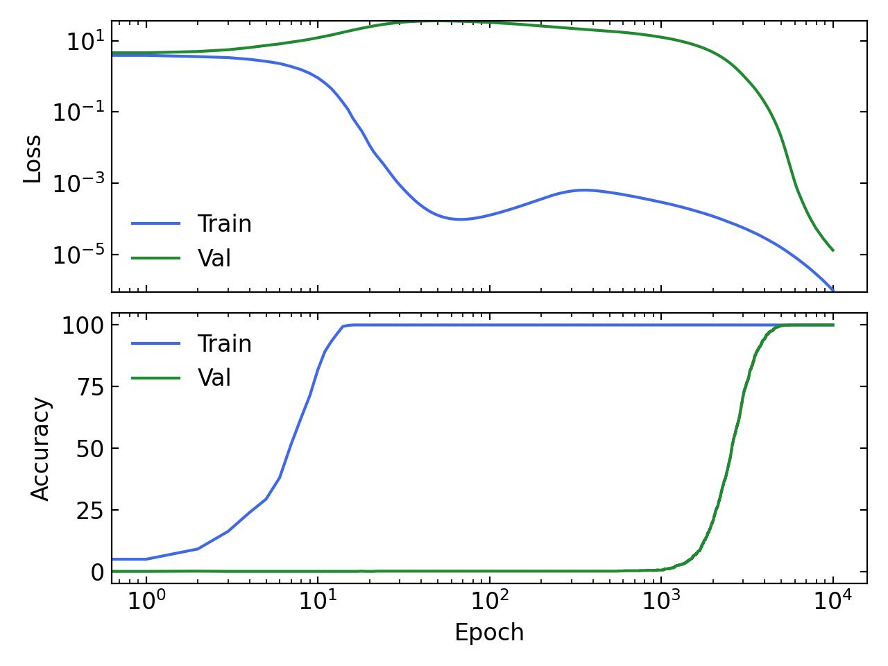
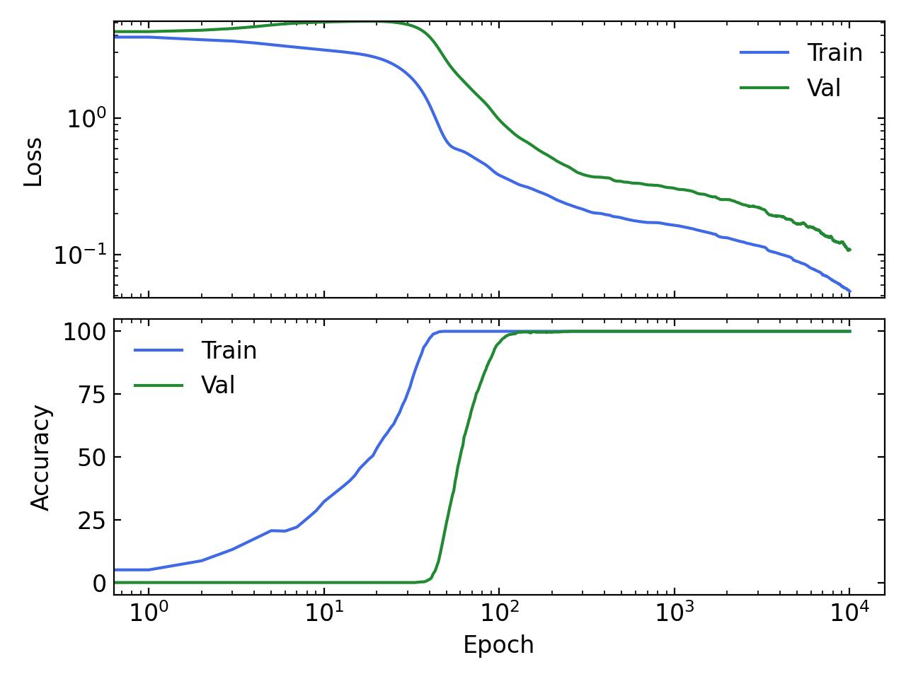

<!-- Change this color later -->

Grokking, the phenomenon by which some models generalize well after overfitting, was very intriguing when it was first observed. In this post, I will try to summarize some observations I made while trying to understand this phenomenon.
## Formation of structure (animated)

The example below is an animation of the first Figure from [our Grokking paper](). 
We visualize the first two principal components of the embeddings of a transformer model trained on the task of addition modulo 59. An interesting feature is that generalization seems to coincide with learning an ordered representation of the embeddings around a circle (much like how a human would reason about modular addition).

What is more intriguing is that this "perfect" representation actually exists very early (up to local ordering of embeddings). In the animation below, the axes are fixed to the first two principal components **at the end of training**. This seems to suggest that the network picks a good representation at initialization and prunes away the noise throughout training. As one might expect, this "lottery ticket" found at initialization gets better (*i.e.*, closer to the perfect representation) the wider the model dimension.

*N.b.*, it is not necessary to get a perfect ordering in the first two principal components for generalization to occur. In some cases, the circle can be "spread out" over many components at different frequencies. For instance, the circle can be ordered modulo 2 in the first two principal components such that there are two degenerate circles on top of each other. But this multiplicity is broken in lower principal components.

## Simple Grokking
If you're interested in playing around with Grokking, I made a very simple implementation that shows a clear delay in generalization. The task is modular addition. The model is a simple 2-layer MLP that takes in two learnable embeddings of dimension hidden_dim=128 concatenated together. Each embedding represents an integer and the target is their sum modulo 53.
The code can be found here: https://github.com/okitouni/simple-grokking

To undo Grokking (i.e. generalize earlier) we can simply increase the amount of weight decay used (from 0.03 to 5) and get the following results:

